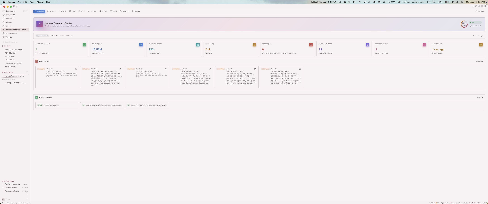
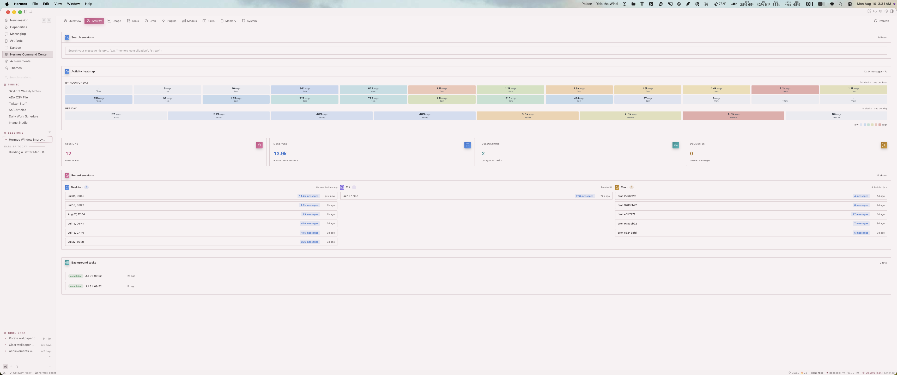
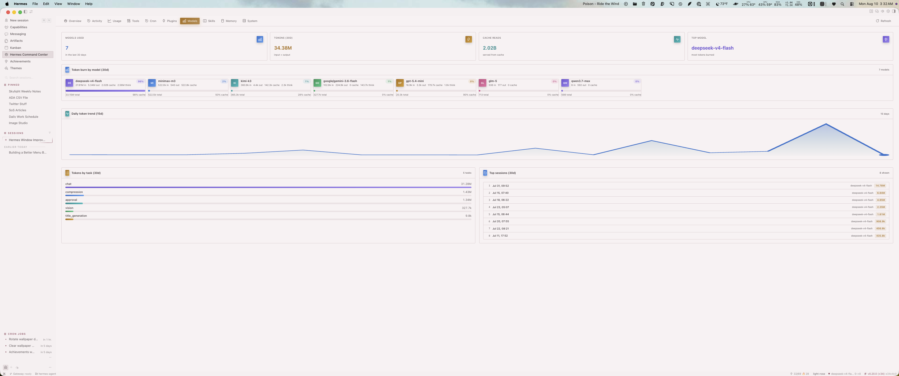

# Hermes Command Center

A read-only health and activity dashboard for your Hermes instance. Ten tabs
that answer "what is my Hermes doing?" in one place: processes, tokens,
cron jobs, plugins, models, skills, memory, and system.







## Features

- **Overview** — live health score with hover breakdown, running backends,
  tokens (24h), cache efficiency, errors, and a composite health ring.
- **Cron** — every scheduled job as a card with its schedule, next run
  countdown, status pill, and last error. Recent executions grouped by day
  with durations.
- **Plugins** — backend plugins as color-coded cards (API status, source,
  last modified) plus compact desktop plugin tiles.
- **Models** — token burn per model with per-model color identity, share of
  total, cache efficiency, and a 15-day gradient area chart.
- **Skills** — ranked most-used skills with medal tiles for the top three,
  usage bars, and state badges.
- **Memory** — always-on memory fill split per file (MEMORY.md / USER.md),
  a health ring, and fact-store counts.

Everything is read-only and computed from your real Hermes state — no new
daemons, no background writers, no telemetry.

## Install

### Backend (plugin API)

1. Copy the plugin into your Hermes home:

   ```bash
   mkdir -p ~/.hermes/plugins/command-center/dashboard
   cp plugin_api.py ~/.hermes/plugins/command-center/dashboard/
   cp plugin.yaml ~/.hermes/plugins/command-center/
   cp manifest.json ~/.hermes/plugins/command-center/dashboard/
   ```

2. Enable it:

   ```bash
   hermes plugins enable command-center
   ```

3. Restart the Hermes desktop app so the backend mounts the API routes.

### Desktop plugin (sidebar page)

1. Copy the UI plugin:

   ```bash
   mkdir -p ~/.hermes/desktop-plugins/command-center
   cp plugin.js ~/.hermes/desktop-plugins/command-center/
   ```

2. Reload desktop plugins (⌘K → Reload desktop plugins) or restart the app.

3. Open **Hermes Center** from the sidebar (or ⌘K → "Hermes Center: Open").

> The desktop app has a built-in Command Center page (`/command-center`).
> This plugin deliberately uses the `/hermes-center` route so the two never
> collide.

## Requirements

- Hermes desktop app (the plugin uses the desktop plugin SDK)
- No API keys required — data comes from your local Hermes state

## Development

- `plugin_api.py` — FastAPI router mounted at `/api/plugins/command-center/`
- `plugin.js` — desktop plugin page (plain ESM, `jsx`/`jsxs` from
  `react/jsx-runtime`, SDK imports from `@hermes/plugin-sdk`)

### Notes for contributors

- The host app's Tailwind build only ships `grid-cols-1/2/4/6` — use inline
  `gridTemplateColumns` for responsive grids (see the code).
- The host bundles a subset of the codicon font — verify any new codicon name
  exists in the packaged app's `codicon-*.css` before shipping. Known-good:
  `dashboard`, `pulse`, `plug`, `globe`, `extensions`, `milestone`, `star`,
  `sparkle`, `symbol-color`, `clock`, `graph`, `database`, `book`, `history`,
  `heart`, `info`, `error`, `refresh`, `play`, `check`, `circle-slash`.

## License

MIT
